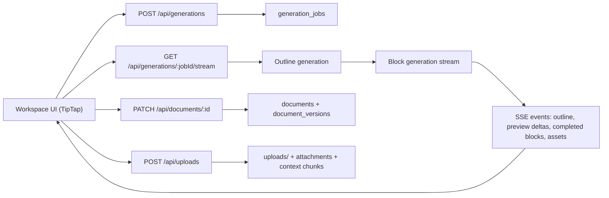

# Architecture

## Goal

Build an AI-powered content editor that can generate structured marketing content, render it in TipTap, and progressively reveal output while generation is still in flight.

## Product Shape

### Current strengths

- TipTap-based rich editor
- Structured AI generation for social posts and blogs
- Layout-aware blocks beyond plain headings and paragraphs
- Clear separation between UI, persistence, and AI orchestration
- Streaming / progressive rendering
- Landing-page support
- File-based grounding
- Version history and preview flow

### Current gaps

- WYSIWYG fidelity
  - Strong custom rendering exists in both editor and preview.
  - The preview is close to the publishing surface, but the editor still exposes editing chrome and some block-level simplifications.
- AI-assisted iteration
  - The rewrite path exists end-to-end.
  - The current implementation should preserve selection ranges, not just selection text.

## System Overview

## Main Building Blocks

### 1. Content schema

`lib/schema/content.ts` defines the allowed generation contract:

- content types: `social_post`, `blog_post`, `landing_page`
- semantic blocks: `rich_text`, `hero_section`, `two_column`, `image_with_copy`, `callout`, `quote`, `cta_banner`, `feature_grid`

These contracts are defined with Zod and form the core boundary between AI output and editor rendering. They keep the model constrained to shapes the editor can actually display.

### 2. Editor schema and TipTap extensions

`lib/editor/extensions.tsx` and `lib/schema/editor.ts` translate semantic blocks into TipTap nodes and React node views.

Why this matters:

- the model does not emit arbitrary HTML
- the client renders only known node types
- progressive placeholder states can be represented inside the document itself
- the same schema layer can be validated before it reaches the editor

The editor supports both:

- placeholder nodes for streaming
- finalized structured nodes for completed sections

### 3. AI layer

`lib/ai/generation.ts` and `lib/ai/prompts.ts` split the problem into two passes:

1. Generate an outline with ordered sections.
2. Generate each section as a structured block.

This two-step approach is the key design decision in the project.

Benefits:

- it makes progressive rendering much easier
- it avoids waiting for one huge structured response
- it keeps prompts smaller and more controllable
- it lets the UI show placeholders and progress at the block level

### 4. Streaming path

`app/api/generations/[jobId]/stream/route.ts` handles orchestration.

Flow:

1. Claim a queued generation job.
2. Generate the outline.
3. Insert placeholders into the draft.
4. Stream each block.
5. Convert streamed preview text into human-readable placeholder updates.
6. Replace placeholders with final TipTap nodes.
7. Trigger image generation for visual blocks.
8. Emit completion or failure events over SSE.

Important design choices:

- SSE is simpler than WebSockets for this one-way event stream.
- Preview updates are not persisted; durable milestones are persisted as generation events.
- The client can reconnect and replay persisted events using event sequence IDs.

## Persistence Model

### Documents

`documents` stores the latest draft state.

### Versions

`document_versions` stores a mix of:

- full snapshots
- JSON patch deltas from checkpoint snapshots

This keeps version history lightweight while still supporting historical preview.

### Jobs and events

`generation_jobs` tracks lifecycle and progress.

`generation_events` stores durable streamed events so reconnecting clients can resume state.

### Attachments

Uploaded files are:

1. stored in database-backed asset storage
2. text-extracted
3. chunked into `document_context_chunks`

This is intentionally simple and fast to operate in the current product shape.

## Why The Architecture Is Reasonable

### Separation of concerns

- `app/api/*` handles transport and auth boundaries.
- `lib/records.ts` handles persistence and document lifecycle.
- `lib/ai/*` handles model calls, prompts, and streaming parsing.
- `lib/schema/*` owns the content contract and editor-safe transforms.
- `components/studio/workspace.tsx` owns interaction and live orchestration on the client.
- Tailwind CSS, Radix UI Themes, and shared primitives keep the visual layer consistent without coupling UI styling to the generation pipeline.

### Extensibility

To add another content type, the main changes are localized to:

- schema definition
- prompt guidance
- block-to-node mapping
- any preview/presentation variants

To swap LLM providers, the main blast radius is the AI client and generation helpers rather than the whole app.

## Tradeoffs

### Chosen tradeoffs

- Block streaming over whole-document streaming
  - Easier to reason about.
  - Better UI progress semantics.
- SSE over WebSockets
  - Lower complexity for server-to-client updates only.
- File chunk grounding over embeddings-based retrieval
  - Faster to ship.
  - Good enough for a first production-minded version.
- Explicit version creation
  - Keeps generation separate from persistence.
  - Avoids auto-saving intermediate states by default.

### Costs of those choices

- Cross-block coherence is weaker than a single holistic final pass.
- Grounding quality is limited when uploaded context is large.
- Generated drafts are live in the editor before they are formally persisted.

## Most Important Gaps

### 1. Rewrite targeting should be range-aware

The current micro-revision flow captures only selected text, not the selection range. A robust implementation would store the selection anchor/head or a stable block/range identifier and replace that exact span when the rewrite returns.

### 2. Grounding should become retrieval-based

The schema already anticipates embeddings, but retrieval currently returns the first matching chunks in order. A better implementation would embed chunks, embed the prompt, and retrieve top-k relevant context.

### 3. Generation persistence could be more explicit

Today generation completes in the editor first, and the user creates a version afterward. With more time, I would support an option to auto-save the generated result as an AI-created version, while still preserving manual control.

## What I Would Improve Next

1. Fix range-safe selection rewriting.
2. Add embedding-based retrieval for attachments.
3. Persist successful generation directly into a new AI version.
4. Add automated tests for document transforms, version hydration, and streaming event sequencing.
5. Add richer publish-surface fidelity for landing pages and blog layouts.
